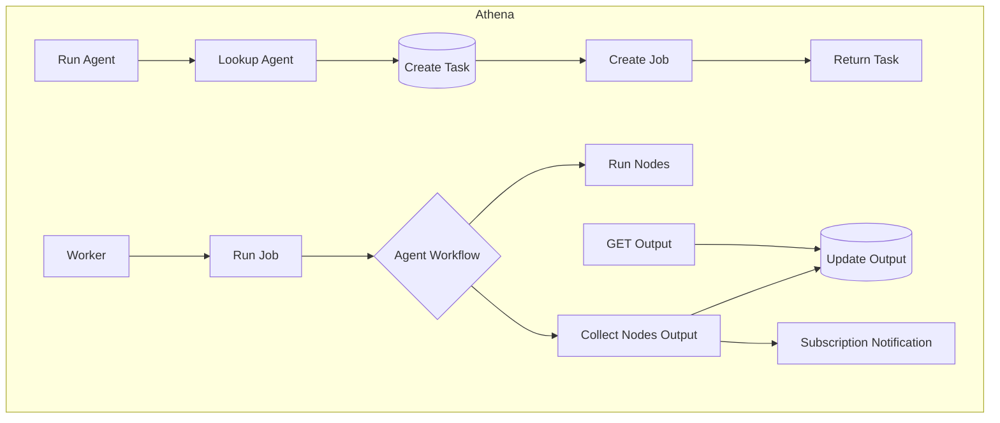

```mermaid
graph TD
    A[Run Agent] --> B[Lookup Agent]
    B --> C[(Create Task)]
    C --> D[Create Job]
    D --> E[Return Task]
    
    F[Worker] --> G[Run Job]
    G --> H{Agent Workflow}
    H --> I[Run Nodes]
    H --> J[Collect Nodes Output]
    J --> K[(Update Output)]
    
    L[GET Output] --> K
    J --> M[Subscription Notification]
    
    subgraph Athena
    A
    B
    C
    D
    E
    F
    G
    H
    I
    J
    K
    L
    M
    end
```
